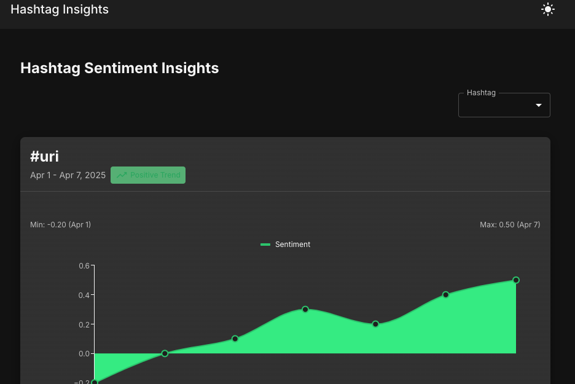

# Hashtag Sentiment Insights

A Next.js application that visualizes sentiment trends for hashtags, built with TypeScript, Material UI, and @mui/x-charts.

## Overview

This project is a frontend engineering assessment that demonstrates the implementation of a hashtag sentiment insight page. The application fetches sentiment data for different hashtags and displays it in an interactive chart with various features.

### Features

- Dynamic routing with `/insights/[hashtag]`
- Interactive line chart visualization using @mui/x-charts
- Responsive design for all device sizes
- Loading and error states
- Hashtag dropdown selector
- Chart zoom/pan interaction
- Min/max sentiment markers
- Dark mode support
- Lazy-loaded components for better performance

## Screenshots


*Main dashboard showing sentiment trends for a hashtag*


*Chart with zoom/pan interaction and min/max markers*


*Responsive design on mobile devices*

## Approach

### Core Implementation

1. **Dynamic Routing**: Implemented Next.js App Router with dynamic routes for different hashtags
2. **Data Fetching**: Created a mock API endpoint that returns sentiment data for different hashtags
3. **Chart Visualization**: Used @mui/x-charts to create an interactive line chart with custom styling
4. **Component Structure**: Organized the code into reusable components with clear separation of concerns
5. **State Management**: Implemented efficient state management with React hooks
6. **Performance Optimization**: Used React.memo, useMemo, and useCallback for performance optimization

### Bonus Features Implementation

1. **Hashtag Dropdown**: Added a dropdown to switch between different hashtags with client-side navigation
2. **Chart Zoom/Pan**: Implemented zoom and pan functionality for the chart to explore data in detail
3. **Min/Max Markers**: Added visual indicators for minimum and maximum sentiment values
4. **Dark Mode**: Implemented a complete theme system with light/dark mode toggle
5. **Lazy Loading**: Used next/dynamic to lazy-load components for better performance

### Challenges & Solutions

- **Chart Updates**: Ensured the chart updates correctly when switching hashtags by implementing direct state management and manual URL updates
- **Loading States**: Created a loading state that only affects the chart area while keeping the page structure intact
- **Responsive Design**: Carefully designed the UI to work well on all device sizes
- **Performance**: Optimized rendering performance with memoization and lazy loading

## Technologies Used

- **Next.js 14**: For server-side rendering and routing
- **TypeScript**: For type safety and better developer experience
- **Material UI**: For UI components and styling
- **@mui/x-charts**: For data visualization
- **React Hooks**: For state management and side effects

## Getting Started

### Prerequisites

- Node.js 18.x or higher
- npm or yarn

### Installation

1. Clone the repository:
   ```bash
   git clone https://github.com/yourusername/hashtag-sentiment-insights.git
   cd hashtag-sentiment-insights